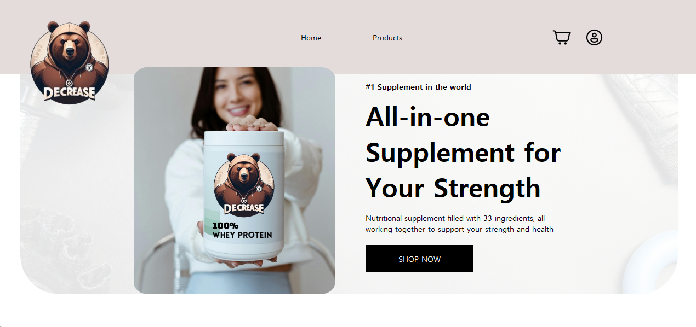
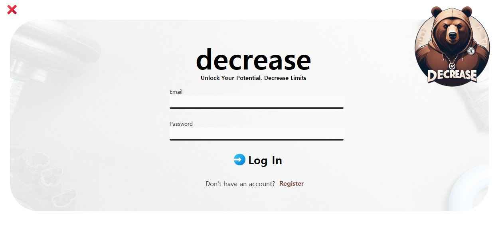
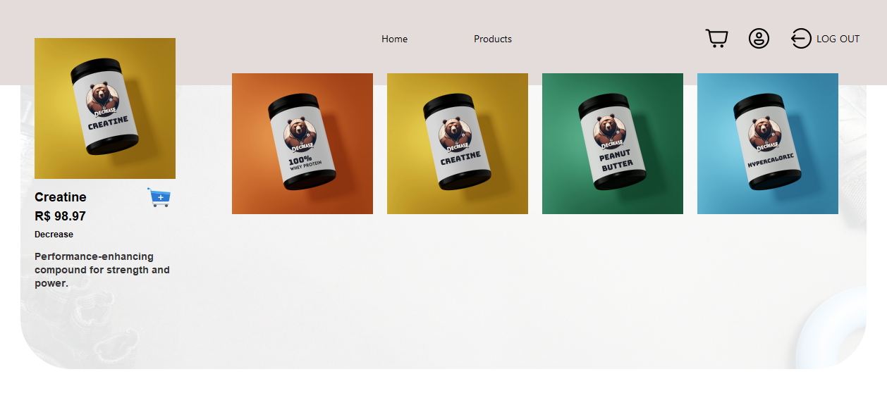
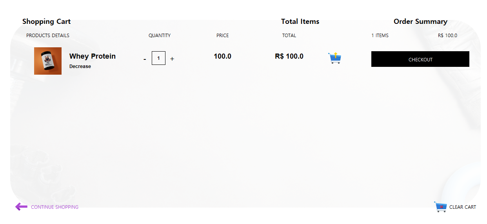
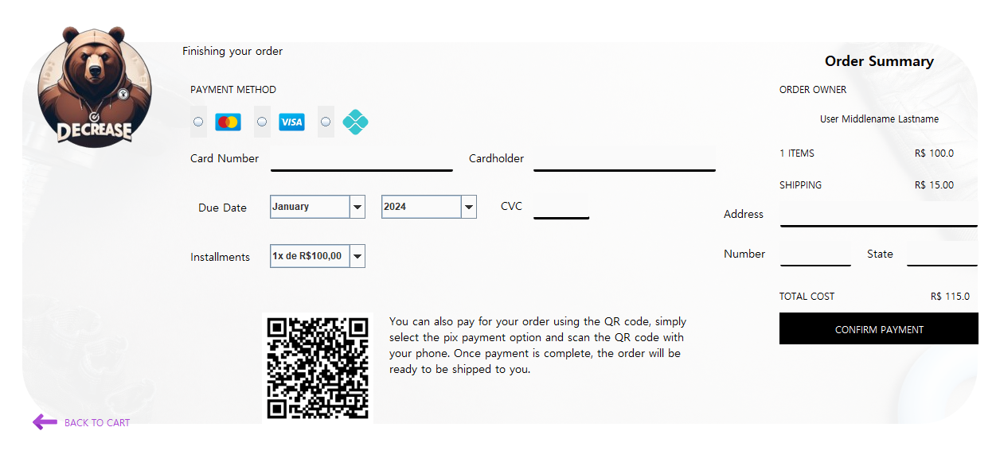

<h1>Decrease Store - Ecommerce Simulado</h1>

    
    
    
    
    

 
 

    <h1>Sobre o projeto👾</h1>
    <p1 style="font-size: 18px;">Um sistema desktop que simula uma loja virtual de suplementos, projetado com flexibilidade para se adaptar a diferentes temas de ecommerce. Embora tenha sido implementado com foco em suplementos esportivos, suas funcionalidades podem ser aplicadas a qualquer tipo de loja online.
    </p1>

 
 

    <h1>Objetivo🎯</h1>
    <p1 style="font-size: 18px;">O projeto, criado como parte de uma avaliação do curso de Ciência da Computação, visa aprimorar habilidades em programação, design de interfaces, testes, arquiteturas de projeto e frameworks Java.</p1>
     
    <p2 style="font-size: 18px;"> Feedbacks sobre o projeto, código, estrutura ou qualquer aspecto relacionado que possa contribuir para melhorias serão bem-vindos e valorizados pelos envolvidos em seu desenvolvimento.
    </p2>

 
 

<h1>Instruções de Instalação e Execução do Projeto 🛠️</h1>

<h2>Requisitos Necessários:</h2>
<ul style="font-size: 18px;">
  <li>Java 17.0.10 instalado na máquina.</li>
  <li>NetBeans 12.6 instalado.</li>
</ul>

<h2>Clonar o Projeto via GitHub:</h2>
<ol style="font-size: 18px;">
  <li>Abra o terminal e certifique-se de que o Git está instalado na sua máquina.</li>
   <li>Escolha a pasta que deseja armazenar o projeto.</li>
  <li>Utilize o comando <code>git clone</code> seguido da URL do projeto: 
    <code>git clone https://github.com/LorenaMuralha23/Projeto-EngSoft-5P-Tests.git</code></li>
  <li>Abra o NetBeans.</li>
  <li>No NetBeans, clique em "File" > "Open Project" e selecione o diretório onde o projeto foi clonado.</li>
  <li>Selecione o projeto e clique em "Open Project".</li>
</ol>

<h2>Pelo Google Drive:</h2>
<ol style="font-size: 18px;">
  <li>Clique no link de acesso abaixo: <a href="#">futuro link</a>.</li>
  <li>Clique com o botão direito sobre a pasta Projeto-EngSoft-5P-Tests e clique em “Fazer download”.</li>
  <li>Após o download, descompacte o arquivo desejado em um local de sua preferência.</li>
  <li>No NetBeans, clique em "File" > "Open Project" e selecione o diretório onde o projeto foi descompactado.</li>
  <li>Selecione o projeto e clique em "Open Project".</li>
</ol>

<h2>Como Rodar o Projeto:</h2>
<ul style="font-size: 18px;">
  <li>Abra o projeto no NetBeans seguindo os passos dados anteriormente.</li>
  <li>Expanda o folder "Source Packages".</li>
  <li>Expanda o package "com.decrease".</li>
  <li>Clique com o botão direito sobre o arquivo EcommerceT1LpApplication.java e clique em Run File.</li>
</ul>

<h2>Visualização do Banco de Dados:</h2>
<ol style="font-size: 18px;">
  <li>Abra o projeto no NetBeans seguindo os passos dados anteriormente.</li>
  <li>Rode o projeto seguindo as instruções dadas acima.</li>
  <li>Com a aplicação em execução, vá ao seu navegador e digite "localhost:8080/h2-console".</li>
  <li>Ao abrir o console do H2, clique em botão.</li>
</ol>

<h2>Como Rodar os Testes Unitários:</h2>
<ul style="font-size: 18px;">
  <li>Abra o projeto no NetBeans seguindo os passos dados anteriormente.</li>
  <li>Expanda o folder "Test Packages".</li>
  <li>Escolha o package das classes em que deseja realizar os testes.</li>
  <li>Clique com o botão direito sobre o arquivo que deseja rodar o teste e selecione a opção "Test File".</li>
</ul>

<h2>Como Ver a Cobertura de Testes através do JaCoco:</h2>
<ul style="font-size: 18px;">
  <li>Abra o projeto no NetBeans seguindo os passos dados anteriormente.</li>
  <li>Clique no projeto com o botão direito e escolha "Clean and Build". Essa opção também está disponível no menu de opções do Netbeans.</li>
  <li>Após a mensagem "Build Success", clique com o botão direito sobre o projeto e selecione Code Coverage > Show Report.</li>
</ul>

Certifique-se de que todos os requisitos necessários estejam instalados e siga os passos acima para configurar e rodar o projeto no NetBeans.

 
 

<h1>Ferramentas Utilizadas🔧</h1>

<ul style="font-size: 18px;">
  <li>Linguagem de Programação: Java 17.0.10</li>
  <li>Gerenciamento de Dependências: Maven</li>
  <li>Framework de Testes de Cobertura: JaCoCo</li>
  <li>Framework de Mocking: Mockito</li>
  <li>Framework de Desenvolvimento Web: Spring Boot</li>
  <li>Abstração de Persistência: Spring Data JPA com Hibernate</li>
  <li>Banco de Dados em Memória: H2 Database</li>
</ul>

 
 

<h1>Testes Realizados🧪</h1>

<h2>Testes Unitários</h2>
<ul style="font-size: 18px;">
  <li>Os testes unitários foram implementados no folder "Test Packages".</li>
  <li>As interfaces e repositórios foram excluídos dos testes.</li>
  <li>Foi testada as classes de Controller e Service, separadas por packages.</li>
</ul>

<h2>Testes Funcionais</h2>
<ul style="font-size: 18px;">
  <li>Foi implementado testes funcionais das principais funcionalidades do projeto.</li>
  <li>Para mais detalhes sobre os testes funcionais, faça download do <a href="#">relatório</a>.</li>
</ul>

 
 

<h1>Funcionalidades Desejadas (ToDo) 📝</h1>

Estas são algumas das funcionalidades que gostaríamos de implementar no futuro para aprimorar o projeto. Por favor, note que o projeto ainda está em desenvolvimento:

<ul style="font-size: 18px;">
  <li><strong>Sistema de Criação de Conta:</strong> Introduzir a capacidade para os usuários criarem suas próprias contas, permitindo uma experiência personalizada e segura.</li>
  
  <li><strong>Implementação da Classe de Usuário Administrador:</strong> Desenvolver e integrar uma classe específica para usuários administradores, possibilitando o gerenciamento eficaz de permissões e configurações avançadas.</li>
  
  <li><strong>Possibilidade do Administrador Cadastrar Produtos:</strong> Permitir que administradores tenham acesso exclusivo para cadastrar novos produtos na loja, fornecendo um fluxo de trabalho simplificado e centralizado para gerenciar o inventário.</li>
</ul>

 
 

<h1>Relatório do Software 📊</h1>

Para mais detalhes sobre o software, faça download do <a href="#">relatório</a>.

 
 

<h1>Créditos 🙌</h1>

<ul style="font-size: 18px;">
  <li>O projeto foi feito pela dupla Maria Lorena Muralha Lima e Luis Fernando Vicarri.</li>
  <li>Agradecemos a ajuda que o Professor Fabio Aiub Sperotto nos deu durante todo o processo.</li>
  <li>Qualquer feedback e contribuição são bem-vindos.</li>
</ul>

